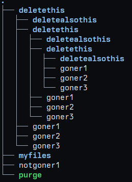
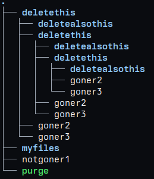
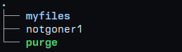

## About
Purge is a simple cli tool that recursively *purges* files from
directories or directories themselves from other directories.
It is simple because it is a single C source file under 200 lines 
compliant with C99 standard.

## Example of usage
Best way to explain how purge works is by showing few examples.

This is a file hierarchy before running `purge`:

---
This command line
> ./purge . goner1

or
> ./purge -f . goner1

will result in this file hierarchy:

---

Additionally running the program with these arguments:
> ./purge -d . deletethis

will result in this file hierarchy:

---

If some things are unclear please just run `purge` without arguments,
and check the usage there, cba explaining any further.

## Building

clone the repository and run:
> make

If you wish to build binary with debug symbols enabled then run:
> make debug

if you wish to have more control on how the binary builds just
edit the single `Makefile` to your liking.
